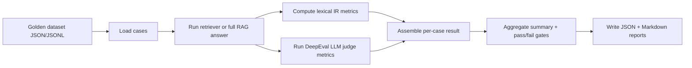

# RAG Eval

Repository: https://github.com/philicamit/RAG-Eval.git

A production-style evaluation harness for retrieval-augmented generation (RAG) systems. This project combines deterministic retrieval metrics with DeepEval LLM-as-judge checks to measure whether a system is retrieving the right evidence, answering the question faithfully, and staying within operational quality gates.

## Clone and run

```bash
git clone https://github.com/philicamit/RAG-Eval.git
cd RAG-Eval
python -m pip install -r requirements.txt
python -m rag_eval --dataset rag_eval/datasets/got_golden.jsonl --output-dir rag_eval/reports
```

## What this project evaluates

The harness checks four things:

- Retrieval quality: did the retriever surface the relevant context?
- Generation quality: is the final answer faithful, relevant, and correct?
- Refusal behavior: for unanswerable questions, does the system refuse appropriately?
- Operational quality: pass rate, latency, and cost for the whole run.

## End-to-end workflow



The real execution path matches the code in `rag_eval/runner.py`:

1. `load_golden_dataset(...)` reads the golden cases.
2. `collect_observation(...)` either calls retrieval-only or full answer generation.
3. `compute_ir_metrics(...)` calculates deterministic lexical retrieval scores.
4. `build_deepeval_metrics(...)` creates DeepEval judges for retrieval and generation quality.
5. `build_summary(...)` aggregates per-case scores into a run summary.
6. `write_reports(...)` writes both JSON and Markdown reports under the output directory.

## Data model and golden cases

Each golden item is a `GoldenCase` with fields such as:

- `input`: the user question
- `expected_output`: the ideal answer
- `expected_context`: reference passages or evidence text
- `expected_keywords`: keywords that must appear in the retrieved evidence
- `expected_doc_ids`: expected document IDs
- `unanswerable`: whether the question should be refused
- `tags`: optional metadata for filtering or grouping

This structure makes it easy to evaluate both fact-based and refusal-sensitive cases.

## Metric families

### 1) Retrieval metrics (deterministic lexical metrics)

These are implemented in `rag_eval/ir_metrics.py` and work without a judge model.

#### Hit at k

This is a binary signal for whether a relevant item appears in the top-k retrieved results.

Formula:

$Hit@k = \begin{cases} 1 & \text{if a relevant result appears in ranks } 1..k \\ 0 & \text{otherwise}
\end{cases}$

In this project the hit check uses either:

- the expected document IDs, or
- the expected context snippets / expected keywords, or
- a token coverage threshold approximating semantic overlap.

#### MRR at k (Mean Reciprocal Rank)

This measures how early the first relevant result appears.

Formula:

$MRR@k = \frac{1}{rank_{first\_relevant}}$

If no relevant result is found, it is 0. This rewards retrieval systems that rank useful documents earlier.

#### Context recall at k

This measures how much of the expected evidence is present in the retrieved context.

Formula:

ContextRecall = average over expected references of (overlap between reference tokens and retrieved tokens) / (reference tokens)

where:

- R = expected reference snippets
- C = retrieved corpus text
- tokens(...) is the normalized token set

If there are expected keywords instead of context passages, this falls back to a hit-style indicator.

#### Keyword recall

This checks how many expected keywords are present in the retrieved output.

Formula:

KeywordRecall = matched_keywords / total_keywords

where K is the set of expected keywords and matched_keywords are those found in the retrieved text.

#### Refusal accuracy

For `unanswerable` cases,

RefusalAccuracy = 1 if the model refuses appropriately; otherwise 0.

The code accepts common refusal markers such as “I do not know”, “I can’t answer”, and “not contained”.

### 2) DeepEval retrieval and generation metrics

These are created in `rag_eval/deepeval_metrics.py` and use the DeepEval library with an LLM judge model.

#### Contextual Relevancy

Measures whether the retrieved chunks are actually relevant to the user question.

Interpretation: it asks whether the retrieved context supports the query, not whether it is merely verbose or noisy.

#### Contextual Precision

Measures how many retrieved items are actually useful relative to the total retrieved set.

Conceptually: 

$ContextualPrecision \approx \frac{\text{relevant retrieved units}}{\text{all retrieved units}}$

This penalizes junk context and low-quality retrieval depths.

#### Contextual Recall

Measures whether the retrieved context contains the expected facts or evidence needed for a correct answer.

Conceptually:

$ContextualRecall \approx \frac{\text{relevant evidence found}}{\text{all expected evidence}}$

#### Faithfulness

Measures whether the answer is supported by the retrieved evidence.

Conceptually:

$Faithfulness \approx \frac{\text{supported claims}}{\text{all claims in the answer}}$

This is especially important for hallucination detection.

#### Answer Relevancy

Measures whether the answer addresses the actual user question and avoids irrelevant content.

Conceptually:

$AnswerRelevancy \approx \frac{\text{relevant answer content}}{\text{full answer content}}$

#### Correctness

This uses a `GEval` judge to compare `actual_output` with `expected_output` and allow wording differences while penalizing missing facts or contradictions.

Conceptually:

$Correctness \approx \text{agreement with expected answer}$

This is the closest thing to a ground-truth comparison in the LLM-as-judge layer.

## Quality gates and summary score

The summary is built in `rag_eval/report.py` and `rag_eval/gates.py`.

### Pass rate

For a run with $N$ cases and $P$ passing cases:

$PassRate = \frac{P}{N}$

This is the primary overall success signal.

### Gate checks

The evaluator fails the run if any of the following are true:

1. `pass_rate < EVAL_MIN_PASS_RATE`
2. A retrieval metric mean is below `EVAL_RETRIEVAL_THRESHOLD`
3. A generation metric mean is below `EVAL_GENERATION_THRESHOLD`
4. `p95 total latency > EVAL_LATENCY_P95_MS`

The code checks the mean of each metric across the dataset and compares it to thresholds.

### Latency summary

The report also records:

- mean total latency
- p50 total latency
- p95 total latency
- mean retrieval latency
- mean generation latency
- mean time-to-first-token (TTFT)

This gives operational signals in addition to quality signals.

## CLI usage

```bash
python -m pip install -r requirements.txt
python -m rag_eval --dataset rag_eval/datasets/got_golden.jsonl --output-dir rag_eval/reports
```

You can also use the environment variables in `EvalSettings.from_env()`:

```bash
export EVAL_DATASET_PATH="rag_eval/datasets/got_golden.jsonl"
export EVAL_METRIC_MODE="all"         # all | retrieval | generation
export EVAL_MODEL="gpt-4o-mini"
export EVAL_RETRIEVAL_THRESHOLD="0.6"
export EVAL_GENERATION_THRESHOLD="0.6"
export EVAL_CORRECTNESS_THRESHOLD="0.6"
export EVAL_MIN_PASS_RATE="0.7"
export EVAL_LATENCY_P95_MS="2500"
```

## Output files

The evaluator writes:

- JSON scorecards under `rag_eval/reports/`
- Markdown summaries under `rag_eval/reports/`
- `latest.json` and `latest.md` as the newest snapshot

This is useful for CI gating, monitoring, and manual review.

## Repository layout

- `rag_eval/` — evaluation framework
- `rag_eval/datasets/` — golden datasets
- `rag_eval/reports/` — generated evaluation results
- `tests/` — regression tests for the evaluator

## Typical interpretation

A strong RAG system should have:

- high retrieval hit rate and early rank placement
- strong context coverage and keyword recall
- faithful, relevant answers
- refusal accuracy on unanswerable questions
- overall pass rate above the configured gate

If you want, the next step is to add a small example output report to this README showing a real run from `latest.md` in a sample format.
